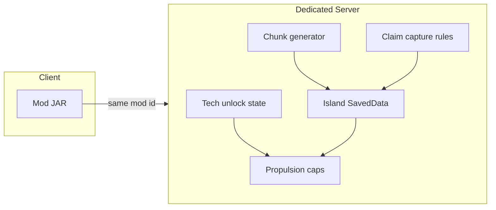

# Project Island

A NeoForge Minecraft **server + client** mod project: a void world of **procedurally generated floating islands** with biome-appropriate surfaces, **per-island ownership** (available, claimed, capturable), and progression toward **mobile island-bases** used to **contest and capture** other islands.

Players join a world that is **already** the island dimension (no portal lobby for the core experience). Island rules, **propulsion unlocks**, and capture outcomes are **server-authoritative** and persisted with the world.

## Game pillars

1. **Survival on an island** — Resources, farming, mining, and building on a bounded floating landmass.
2. **Territory** — Claim, defend, lose, or **steal** islands; alliances optional.
3. **Island as airship** — Players upgrade their island into a **slowly moving base** (sails → propellers → jet-style thrust), then use mobility to **raid or capture** neighbors—not only bridges or static skybases.
4. **Tech progression** — An **advancement / unlock tree** (vanilla-style advancements, custom research, or both) gates better propulsion, utility, and defense. Higher tiers allow **more thrust modules** or efficiency where design requires it.

## Propulsion tiers (design target)

| Stage | Role | Notes |
|-------|------|--------|
| **Level 1** | **Sails** | Slow island movement; cheap or early unlock. |
| **Level 2** | **Propellers** | Faster than sails; **sub-tiers** increase allowed thrust or count. |
| **Level 3** | **Jet engines** | Top-end speed band; **sub-tiers** increase thrust caps or fuel tradeoffs. |

Other branches (defense, docking / merge, power, automation) should get **their own tier tracks** in design docs and [TODO.md](TODO.md). Visual and mechanical flavor can include **helm**, **cogwheels** (often paired with **Create**-style motion), **sails**, **propellers**, and **jets**, depending on era unlocked.

## Roadmap and history

- [TODO.md](TODO.md) — phased checklist from bootstrap through ops.
- [CHANGELOG.md](CHANGELOG.md) — notable changes ([Keep a Changelog](https://keepachangelog.com/en/1.1.0/) style).

**Current focus:** **Phase 2 is done** (overworld floating islands + procedural island biomes). Next up: **Phase 4** claims — starter: **region-spiral** search for **`AVAILABLE`** keys, **atomic auto-claim** once per player UUID, teleport on **region center / HUD-aligned** surface (not the current chunk-spiral **void-rescue** rim); **dense spawn**: capped search + documented fallback; **dock / link** for extra islands — see [TODO.md](TODO.md) Phase 4.

## Target stack

- **Loader:** NeoForge (pinned in [`gradle.properties`](gradle.properties)).
- **Distribution:** matching mod JAR on dedicated server and every client.
- **Integrations (later, version-locked):** **Valkyrien Skies** (and related ship mods) for **rigid moving assemblies**; **Create** for **cogwheels, kinetic contraptions**, and polish on moving platforms. Document exact versions in this README when they are chosen. Custom code may still wrap fuel, thrust caps, and unlock checks.

## Resource packs (what ships in the JAR)

**New Default+** (CurseForge / Modrinth) and many other artist packs are **not** redistributable inside this mod’s JAR unless their license explicitly allows it (New Default+ is typically **all rights reserved**). Players can still install those packs **manually** in `.minecraft/resourcepacks` and enable them above vanilla.

This repository **does** ship a small **CC0** pack bundled in the mod file:

- **[Unshaded Blocks](https://modrinth.com/resourcepack/unshaded-blocks)** (v2.1 for Minecraft 1.21.1) — removes legacy **block shading** on most blocks for a **flatter, cleaner** look. It is **not** a full HD overhaul like New Default+. Attribution: [`licenses/UNSHADED_BLOCKS_ATTRIBUTION.txt`](licenses/UNSHADED_BLOCKS_ATTRIBUTION.txt).

The mod registers it as a **built-in client resource pack** (`AddPackFindersEvent` in `ProjectIslandClient`). Enable or reorder it under **Options → Resource Packs** like any other pack (place **above** vanilla if you combine it with other packs).

For **glowing ores / neon** style, you usually want a **shader** (e.g. Complementary, BSL) in addition to or instead of only a texture pack.

## Learning from existing work

When designing worldgen, ships, progression, or UX, **actively reuse ideas and patterns** from public sources (always respect **licenses** and **attribution**):

- **Mods** (CurseForge, Modrinth, GitHub)—e.g. movement/ship libraries, tech mods, claim mods (for anti-patterns as well as features).
- **Datapacks** and **world presets**—quick iteration on loot, advancements, and experimental rules.
- **Modpacks**—see how authors balance gating, grind, and multiplayer load.
- **GitHub**—reference implementations, NeoForge MDKs, and small MIT/BSD examples; do not copy GPL code into incompatible targets without legal review.

Prefer **pinned** versions and a short **compatibility / inspiration** note in this README when a third-party mod becomes a hard dependency.

This project was bootstrapped from the official **[ModDevGradle MDK for Minecraft 1.21.1](https://github.com/NeoForgeMDKs/MDK-1.21.1-ModDevGradle)** template (NeoForged). See NeoForge docs: [Getting Started](https://docs.neoforged.net/docs/1.21.1/gettingstarted/).

### Pinned toolchain (bootstrap)

| Piece | Version |
|-------|---------|
| Minecraft | 1.21.1 |
| NeoForge | 21.1.227 |
| Parchment (MC / mappings) | 1.21.1 / 2024.11.17 |
| ModDevGradle plugin | 2.0.141 (`build.gradle`) |
| Gradle (wrapper) | 9.2.1 |
| Java | **21** |

## Architecture (high level)



## World (Phase 2)

The mod registers **`projectisland:floating_islands`** as a **chunk generator type** and ships a built-in **datapack override** for the overworld dimension under `data/minecraft/` (same pattern as shipping JSON in the mod JAR—**no separate download**):

| Piece | What it is |
|-------|------------|
| `minecraft:overworld` | Same dimension id players always join; **terrain** is replaced by **void + scattered ellipsoid islands** (stone/dirt subsurface; tops **grass / sand / snow / mycelium** from overworld biome, including **mushroom fields**). Nether and End are unchanged. |
| `projectisland:floating_islands` | **Chunk generator codec id** (not a separate dimension). |

Details:

- **Dimension type** stays `minecraft:overworld` (sky, day cycle, monster ranges) so the sky feels familiar while terrain is custom.
- **Generator** is Java (`FloatingIslandsChunkGenerator`): islands sit on a **sparse** coarse grid (8×8 chunks per cell, ~17% spawn). Each mass uses an **asymmetric** profile (short **vrTop** dome + longer **vrBottom** tail with **extra depth under the rim**), **smooth** horizontal scaling (no block-step noise), a **wider flat-ish plateau** on top (`horiz^0.72` inside the cap), and a **low-frequency** vertical hill so surfaces read as gentle terrain rather than Swiss cheese. **Vanilla structures** (mineshafts, ruined portals, etc.) still run, then a **trim pass** removes structure blocks in **void columns** or **floating above** the island top so pieces tend to **cling to land** where they intersect it; **biome decoration** (trees, flowers, ores) still runs. (Shader lighting in reference art is separate from this terrain pass.)
- **Biomes:** overworld dimension JSON still uses **`minecraft:multi_noise`** preset **`minecraft:overworld`** (structures / compatibility). **Island land** does **not** use vanilla climate sectors for the chunk biome palette: each **`FloatingIslandKey`** (8×8-chunk region that owns an island) gets **one** overworld biome from **weighted random**, deterministic from **world seed + region X/Z** via `RandomState.getOrCreateRandomFactory`. Tune with **`islandBiomeWeight*`** in **`config/projectisland-common.toml`** — full key list and dedicated-server notes under **[Island biome weights (common config)](#island-biome-weights-common-config)**. **Void** sky columns use **plains** so F3 is not stuck on river/ocean. **Note:** `noise_settings` **`size_horizontal`** is an **integer `1`–`4`** in 1.21.1 (vanilla overworld is **`1`**).
- **Tuning** (`config/projectisland-common.toml` on client or server): `floatingIslandsRareStructureKeepChance` — each **monster room** or **trial chamber** that appears in a chunk is **kept** with this probability after trim (default `0.12`; use `1.0` to disable thinning). **Per-island biome weights** — see **[Island biome weights (common config)](#island-biome-weights-common-config)**. `floatingIslandsExtraSurfaceTreesPerChunk` — extra vanilla **surface features** after decoration (default `5`; `0` disables): **oak / fancy oak / birch** on **grass**, **spruce / pine** on **snow**, **huge mushrooms** on **mycelium**, **acacia / oak** on **sand**. **Spawn pregen (optional):** `spawnPregenChunkRadius` (Chebyshev chunk radius around overworld spawn, **`0` = off**) and `spawnPregenChunksPerTick`. **Starter island (Phase 4):** `starterIslandAutoAssignEnabled`, `starterIslandSearchFromWorldSpawn`, `starterIslandMaxRegionSearchRadius`, `starterIslandMinRegionSeparation`, `starterIslandFailureKickMessage` — first join assigns one **`AVAILABLE`** region as **CLAIMED** and teleports to **region center** (HUD-aligned); void rescue still runs afterward if needed. **`voidRescueEachTick`** (default **true**): while falling in the void with **no** island surface under the hitbox, rescue runs **once** when Y reaches **`minBuildHeight` + `voidRescueTriggerBlocksAboveMinY`** (default **48** → about **Y −16** when min is **−64**), then **starter** or **nearest island** — not mid-air high above the floor (rim-safe). Join / dimension change still uses **immediate** relocation if you are not on a surface. Long falls with **`allow-flight=false`** may still risk a flight kick before the floor trigger; raise **`voidRescueTriggerBlocksAboveMinY`** or enable **`allow-flight`** on the server if needed. **Death respawn:** unsafe overworld void positions (missing bed, etc.) are redirected to **starter** or nearest surface via **`PlayerRespawnPositionEvent`**; a valid **bed** in the overworld is kept. **Island HUD (server):** `islandHudSyncEnabled`, `islandHudSyncIntervalTicks`, `islandHudRegionScanRadius`, `islandHudHeightAbovePeakBlocks` — sync is driven from **`ServerTickEvent.Post`** (per-player interval). **`ProjectIslandDimensions.isFloatingIslandsGameplay`** gates sync (direct `FloatingIslandsChunkGenerator` or shallow **delegate** on `ChunkGenerator`). **Island HUD (client only):** `config/projectisland-client.toml` — `islandHudShow`, `islandHudTextScale`, `islandHudSeeThroughText`, `islandHudNightColorBoost`.

### Island biome weights (common config)

NeoForge registers these as **`ModConfig.Type.COMMON`** → **`config/projectisland-common.toml`** in the instance directory (single-player save folder **or** dedicated server root—**this is the file operators edit on a server**, alongside structure thinning and island HUD server options).

After changing weights, **restart** the server or client session so worldgen reads values consistently. **Chunks already generated** keep their stored biome palette; **new** chunks (or a **new** world) pick up the new distribution.

Each key is an integer weight **`0`–`1000`**. **`0`** removes that biome from the pool; weights are **relative** (the roll normalizes by the sum of all positive weights). Keep **at least one** weight **greater than `0`** (otherwise the implementation falls back to plains).

| TOML key | Minecraft biome |
|----------|------------------|
| `islandBiomeWeightRiver` | `minecraft:river` |
| `islandBiomeWeightPlains` | `minecraft:plains` |
| `islandBiomeWeightForest` | `minecraft:forest` |
| `islandBiomeWeightTaiga` | `minecraft:taiga` |
| `islandBiomeWeightDesert` | `minecraft:desert` |
| `islandBiomeWeightSnowyPlains` | `minecraft:snowy_plains` |
| `islandBiomeWeightJungle` | `minecraft:jungle` |
| `islandBiomeWeightMushroomFields` | `minecraft:mushroom_fields` |
| `islandBiomeWeightBadlands` | `minecraft:badlands` |
| `islandBiomeWeightWindsweptForest` | `minecraft:windswept_forest` |
| `islandBiomeWeightSwamp` | `minecraft:swamp` |

Try it in a dev world (you are already in overworld):

```text
/tp @s 0 120 0
```

If you land in void sky, the mod **moves you onto the nearest procedural island** on **login**, **return to overworld**, or **dimension change** to overworld (spiral search from arrival XZ; multi-sample per chunk). Prefer a **new world** when upgrading from older builds that used a **separate dimension id**—overworld terrain may not match old vanilla slices.

**Migration:** older Project Island builds used `projectisland:floating_islands` as a **dimension**. That entry is removed so **island saved data** (`projectisland_floating_islands.dat`) lives only on **overworld**. Delete leftover `DIM1` (or similar) folders from old test worlds if present.

(`teleport` and `tp` are equivalent in Java Edition; use a leading **`/`** so the game treats it as a command, not chat.)

### Dedicated server (`./gradlew runServer`): you must be OP

The MDK server starts with an **empty** [`run/ops.json`](run/ops.json). Without operator permission, Brigadier often reports **`Unknown or incomplete command`** with the caret under the first **`/`** even though the syntax is fine.

Pick one:

1. **From the server console** (no `/` prefix): `op Dev` — use the **exact** name shown when you join (default dev client user is often `Dev`).
2. **Copy the example ops file** from the repo root: [`dev-ops.example.json`](dev-ops.example.json) → `run/ops.json` (already done in this workspace for offline UUID of `Dev`), then **restart** the server.

Single-player worlds need **Allow Cheats** (or **Open to LAN** with cheats) instead.

Fly around (`F3` debug lists `ChunkGenerator: projectisland:floating_islands` on the debug pie when relevant). Vanilla **feature decoration** (trees/ores) runs on solid surfaces after noise fills, plus optional **bonus trees** from config; **each island region** uses one rolled overworld biome (see **[Island biome weights (common config)](#island-biome-weights-common-config)**).

### Phase 3 — Island identity and persistence (initial)

- **Stable id:** `FloatingIslandKey` = coarse grid `(regionX, regionZ)` — the same cell the procedural RNG uses (`FloatingIslandLayout.REGION_CHUNKS`). For a block column, `FloatingIslandLayout.islandOwningSurface` picks the neighbor region whose ellipsoid **wins** the surface height (ties broken deterministically).
- **Saved data:** overworld file `projectisland_floating_islands.dat` via `FloatingIslandSavedData` (`IslandState`: `AVAILABLE`, `CLAIMED`, `CONTESTED` placeholder). Rows are created on demand.
- **Starter claim (Phase 4):** on **`PlayerLoggedIn`**, players without a **`StarterHomes`** entry get the first **`AVAILABLE`** island in a **region** spiral from shared spawn (configurable); **`FloatingIslandSavedData`** records **CLAIMED** + starter map; returning players in the **void** are moved back to that island’s **center** surface when possible. **`PlayerTickEvent.Pre`:** **`FloatingIslandVoidRescue`** rescues **once per void fall** when Y nears **`minBuildHeight` + `voidRescueTriggerBlocksAboveMinY`** (starter, then nearest island) if **`voidRescueEachTick`** is on. **`PlayerRespawnPositionEvent`:** **`FloatingIslandRespawnHandler`** fixes respawns that would land in void (prefers **starter**, else nearest surface); **bed** anchors that are already safe are unchanged.
- **Debug (cheats / OP level 2):** `/projectisland island here` — prints the island key and `IslandRecord` state at your feet (void columns report none). **`/projectisland island claim`** — interim **AVAILABLE → CLAIMED** for the island under your feet (testing until dock/link gameplay).
- **Nearby island HUD (read-only):** while you are in the **floating-islands overworld** (server uses `ProjectIslandDimensions.isFloatingIslandsGameplay`), the server periodically sends **`IslandHudBeacon`** rows for a configurable **region radius** around you (`IslandHudSyncPayload` → `IslandHudClientCache`). The client draws **`IslandHudWorldBillboard`** panels on **`RenderLevelStageEvent.Stage.AFTER_TRANSLUCENT_BLOCKS`** so the **pose stack matches world space** (do **not** drive these billboards from **`AFTER_LEVEL`**: that stage’s **frustum is not valid** for world-space AABBs and will cull everything). Culling is by **camera distance** (~90% of `renderDistance × 16`) plus a **relaxed `ClientLevel.hasChunk` check** (beacon chunk within a few chunks of the player if the column is not yet flagged loaded). **64×64 PNG icons** in `assets/projectisland/textures/gui/island_hud/` — claimed uses `floating-island.png`; available alternates `floating-island_ex.png` / `floating-island.png` on a slow hold; contested uses a vanilla torch item. **Procedural two-word names** (`FloatingIslandDisplayName`), status line, and `regionX;regionZ` id. See-through / night boost in **client** config. Not a claim UI or world border—see [TODO.md](TODO.md) Phase 4.

## Building

Requires **JDK 21**. From the repository root:

```bash
./gradlew build
```

Outputs: `build/libs/projectisland-<version>.jar` (use the JAR **without** `-sources` or `-javadoc` on servers and clients).

```bash
./gradlew runClient
./gradlew runServer
```

The first Gradle run downloads Minecraft and NeoForge artifacts and can take several minutes.

## License

Mod metadata currently uses **All Rights Reserved** ([`gradle.properties`](gradle.properties)); replace with a SPDX license id and a `LICENSE` file when you decide redistribution terms.

---

_Documentation last revised **22 April 2026** (island biome weight table; `projectisland-common.toml` on dedicated servers; Phase 4 starter / spawn intent in **Current focus**)._
