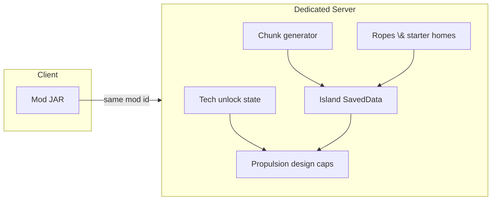

# Project Island

A NeoForge Minecraft **server + client** mod and **modpack** foundation: a **high-fantasy mythical RPG** set on **procedurally generated floating islands** in the void—**FTB Quests**, staged progression, mounts (e.g. **Wings Of Fire**), dungeon-friendly loot (**Lootr**), and **classes / skill trees** via the pinned **Skill Tree (RPG Series)** stack ([MOD_LIST.md](MOD_LIST.md)). **Server-authoritative** island data drives **starter placement**, **public rope ziplines**, HUD/navigation, and worldgen helpers; **capture / raid meta** is **roadmap-only** ([TODO.md](TODO.md) Phase 5), not current gameplay.

Players join the **overworld** as floating-island terrain (no portal lobby for the core experience). Island tech and outcomes stay **server-driven**, not client-trusted.

## Game pillars

1. **RPG progression** — Quest-led arcs, loot, mounts, and (when pinned) magic or class identity—gated with **ProgressiveStages** / server checks where it matters.
2. **Survival on sky islands** — Resources, farming, mining, and building on bounded landmasses over the void; structures and dungeons spawn on solid surfaces.
3. **Exploration and spectacle** — Mythical tone, dungeons, mounts, and sky-island logistics (**ropes**, **Create**, WoF). **Island claiming was removed**; ziplines are **public**. Future **capture / PvP** rules would build on saved data and server checks ([TODO.md](TODO.md) Phase 5), not client trust.
4. **Mobility** — **Ropes**, **mounts** (e.g. WoF), vanilla gear, and **Create**-style contraptions for local tech—not **Create Aeronautics** or **Valkyrien Skies** in the official pack. Optional **whole-island movement** remains a **future / custom** design topic if you revisit capture meta.

## Propulsion tiers (design reference only — not VS / Create Aeronautics)

| Stage | Role | Notes |
|-------|------|--------|
| **Level 1** | **Sails** | Slow island movement; cheap or early unlock. |
| **Level 2** | **Propellers** | Faster than sails; **sub-tiers** increase allowed thrust or count. |
| **Level 3** | **Jet engines** | Top-end speed band; **sub-tiers** increase thrust caps or fuel tradeoffs. |

Other branches (defense, docking / merge, power, automation) can get **their own tier tracks** in design docs and [TODO.md](TODO.md) if you add custom island mobility later. The table is **not** tied to **Valkyrien Skies** or **Create Aeronautics** (out of scope for the current modpack).

## Roadmap and history

- [TODO.md](TODO.md) — phased checklist from bootstrap through ops.
- [CHANGELOG.md](CHANGELOG.md) — notable changes ([Keep a Changelog](https://keepachangelog.com/en/1.1.0/) style).
- [MOD_LIST.md](MOD_LIST.md) — **required third-party JARs** for the official modpack (pinned filenames; install into your local **`run-client/mods`** / **`run-server/mods`** for Gradle dev runs — those trees are **gitignored**). Villager defense: **[Villager Guards](https://modrinth.com/mod/villager-guards)** (**`villager-guards-v1.1.5.jar`**) is listed **first** there; avoid stacking other guard/conversion mods without testing.

**Current focus:** **Phase 2 is done**; **Phase 4** includes shared starter hub, public **rope / harpoon** links (tiered span/HP), **rope surfing**, **linked-anchor mining** (damages rope HP), **larger islands** (`floatingIslandHorizontalRadiusBonus`), **optional ore thinning** (`floatingIslandsOreMultiplier*`), island HUD, and **modpack** pins (**Lootr**, **Wings Of Fire**, **Skill Tree + RPG Series**, optional **Friends&Foes**, FTB stack — [MOD_LIST.md](MOD_LIST.md)). **Player progression UI:** **FTB Quests** (intro **Project Island** chapter + **RPG Series \& Skills** chapter after Iron Age) + **ProgressiveStages** under **`examples/dev-progression/`** (copy into **`run-client`** / **`run-server`** `config/` for dev). **Void rescue** prefers **procedural island centers** and skips ticks while **rope surfing**. Pack direction: **high-fantasy mythical RPG** on floating islands — see pillars above and [TODO.md](TODO.md).

## Target stack

- **Loader:** NeoForge (pinned in [`gradle.properties`](gradle.properties)).
- **Distribution:** matching mod JAR on dedicated server and every client.
- **Integrations:** **[Create](https://modrinth.com/mod/create)** is pinned for **kinetic / contraption** gameplay ([MOD_LIST.md](MOD_LIST.md)). **Valkyrien Skies** and **Create Aeronautics** are **not** part of the official stack right now. Optional mods (**Waystones**, **Lootr**, **Wings Of Fire**, maps, etc.) stay version-locked in the manifest when listed.

## Resource packs (what ships in the JAR)

**New Default+** (CurseForge / Modrinth) and many other artist packs are **not** redistributable inside this mod's JAR unless their license explicitly allows it (New Default+ is typically **all rights reserved**). Players can still install those packs **manually** in `.minecraft/resourcepacks` and enable them above vanilla.

This repository **does** ship a small **CC0** pack bundled in the mod file:

- **[Unshaded Blocks](https://modrinth.com/resourcepack/unshaded-blocks)** (v2.1 for Minecraft 1.21.1) — removes legacy **block shading** on most blocks for a **flatter, cleaner** look. It is **not** a full HD overhaul like New Default+. Attribution: [`licenses/UNSHADED_BLOCKS_ATTRIBUTION.txt`](licenses/UNSHADED_BLOCKS_ATTRIBUTION.txt).

The mod registers it as a **built-in client resource pack** (`AddPackFindersEvent` in `ProjectIslandClient`). Enable or reorder it under **Options → Resource Packs** like any other pack (place **above** vanilla if you combine it with other packs).

For **glowing ores / neon** style, you usually want a **shader** (e.g. Complementary, BSL) in addition to or instead of only a texture pack.

### Progress UI (preferred for modpacks)

- **FTB Quests** — the primary “modern tree” UI (tasks + rewards).
- **ProgressiveStages** — a stage/level system the **server** can check to gate mechanics (items/recipes/tiers), independent of client UI.

Vanilla advancements can still exist for lightweight toasts/milestones, but they're not the core progression UI for Project Island.

**Dev runs:** FTB quest chapters (**`project_island`** + **`rpg_series`**) and Project Island–specific stage files live under `examples/dev-progression/`. **`./gradlew runClient`** / **`runServer`** automatically runs **`syncDevProgressionConfigs*`** first, copying into **`run-client/config/`** and **`run-server/config/`** so **FTB Quests** sees **`config/ftbquests/quests/`** (if those folders are missing, the quest book opens **empty**). Run **`./gradlew syncDevProgressionConfigs`** manually after editing snippets, or copy the same trees into any other instance’s **`config/`**. Those game dirs are **gitignored**. Use **`/progressivestages reload`** after editing stage TOML (and **`/progressivestages validate`** for typos). **`triggers.toml`** maps **`minecraft:story/mine_stone` → `stone_age`** and **`minecraft:story/smelt_iron` → `iron_age`** so stock **`iron_age.toml`** locks match vanilla progression (and **JEI** shows the **Harpoon Gun** after smelting iron). The harpoon recipe is **`data/projectisland/recipe/harpoon_gun.json`**.

## Learning from existing work

When designing worldgen, ships, progression, or UX, **actively reuse ideas and patterns** from public sources (always respect **licenses** and **attribution**):

- **Mods** (CurseForge, Modrinth, GitHub)—e.g. movement/ship libraries, tech mods, claim mods (for anti-patterns as well as features).
- **Datapacks** and **world presets**—quick iteration on loot, advancements, and experimental rules.
- **Modpacks**—see how authors balance gating, grind, and multiplayer load.
- **GitHub**—reference implementations, NeoForge MDKs, and small MIT/BSD examples; do not copy GPL code into incompatible targets without legal review.

Prefer **pinned** versions and a short **compatibility / inspiration** note in this README when a third-party mod becomes a hard dependency.

This project was bootstrapped from the official **[ModDevGradle MDK for Minecraft 1.21.1](https://github.com/NeoForgeMDKs/MDK-1.21.1-ModDevGradle)** template (NeoForged). See NeoForge docs: [Getting Started](https://docs.neoforged.net/docs/1.21.1/gettingstarted/).

### Pinned toolchain (bootstrap)

| Piece | Version |
|-------|---------|
| Minecraft | 1.21.1 |
| NeoForge | 21.1.227 |
| Parchment (MC / mappings) | 1.21.1 / 2024.11.17 |
| ModDevGradle plugin | 2.0.141 (`build.gradle`) |
| Gradle (wrapper) | 9.2.1 |
| Java | **21** |

## Architecture (high level)



## World (Phase 2)

The mod registers **`projectisland:floating_islands`** as a **chunk generator type** and ships a built-in **datapack override** for the overworld dimension under `data/minecraft/` (same pattern as shipping JSON in the mod JAR—**no separate download**):

| Piece | What it is |
|-------|------------|
| `minecraft:overworld` | Same dimension id players always join; **terrain** is replaced by **void + scattered ellipsoid islands** (stone/dirt subsurface; tops **grass / sand / snow / mycelium** from overworld biome, including **mushroom fields**). Nether and End are unchanged. |
| `projectisland:floating_islands` | **Chunk generator codec id** (not a separate dimension). |

Details:

- **Dimension type** stays `minecraft:overworld` (sky, day cycle, monster ranges) so the sky feels familiar while terrain is custom.
- **Generator** is Java (`FloatingIslandsChunkGenerator`): islands sit on a **coarse** grid (8×8 chunks per cell; **`floatingIslandRegionSpawnChance`** defaults to ~**34%** per cell — tune up for less void between land). Each mass uses an **asymmetric** profile (short **vrTop** dome + longer **vrBottom** tail with **extra depth under the rim**), **smooth** horizontal scaling (no block-step noise), a **wider flat-ish plateau** on top (`horiz^0.72` inside the cap), and a **low-frequency** vertical hill so surfaces read as gentle terrain rather than Swiss cheese. **Vanilla structures** (mineshafts, ruined portals, etc.) still run, then a **trim pass** removes structure blocks in **void columns** or **floating above** the island top so pieces tend to **cling to land** where they intersect it (**`minecraft:village_*`** jigsaw types such as **`village_plains`**, plus **`pillager_outpost`**, skip the “above surface” trim so multi-block buildings — and villager beds / POI — stay intact); **masked overworld carvers** (**`floatingIslandsEnableMaskedOverworldCarvers`**, default **true**) run vanilla noodle/range-style carving **inside** procedural island columns only (open void stays empty); **`floatingIslandsMaskedCarverNeighborChunkRadius`** defaults to **5** (**11×11** chunks; vanilla reach uses **8** / **17×17**) to reduce worldgen cost; **`floatingIslandsLocateStructureMaxRingRadius`** caps **`/locate structure`** ring scans so trial chambers / locate cannot watchdog-freeze the server for tens of seconds; **`floatingIslandsTrimStripMineshaftThroughVoid`** defaults **false** so mineshaft corridors through sky between columns stay intact. **biome decoration** (trees, flowers, ores) still runs. (Shader lighting in reference art is separate from this terrain pass.)
- **Structure Y + void-only pieces (modded/vanilla):** `getBaseHeight` / `getBaseColumn` already follow **island surface** (so jigsaw and height-aware placement can find land). **`floatingIslandsChunkGeneratorSeaLevel`** sets only **`ChunkGenerator#getSeaLevel()`** (default **100**); **`Level#getSeaLevel()`** is still the overworld **dimension type** (usually **~63**) — some library code uses the **chunk generator** value for vertical math, so tune the config if a structure mod anchors oddly. **`floatingIslandsRemoveStructuresWithNoLandContact`** (default **true**) removes structure **starts** whose footprint rules say they lack island contact (reduces pure-void debris); **`floatingIslandsRuinedPortalChunkLocalLandAnchor`** fixes **`minecraft:ruined_portal`** false positives from huge vanilla search boxes; **`floatingIslandsTrimStructureVoidBlocksAfterFeatures`** re-runs void-column structure trimming before decoration for late-placed pieces. Set **`floatingIslandsRemoveStructuresWithNoLandContact`** **false** if a pack needs intentional floating builds.
- **Biomes:** overworld dimension JSON still uses **`minecraft:multi_noise`** preset **`minecraft:overworld`** (structures / compatibility). **Island land** does **not** use vanilla climate sectors for the chunk biome palette: each **`FloatingIslandKey`** (8×8-chunk region that owns an island) gets **one** overworld biome from **weighted random**, deterministic from **world seed + region X/Z** via `RandomState.getOrCreateRandomFactory`. Tune with **`islandBiomeWeight*`** in **`config/projectisland-common.toml`** — full key list and dedicated-server notes under **[Island biome weights (common config)](#island-biome-weights-common-config)**. With **Biomes O' Plenty** installed, **`islandBiomeModIntegrationEnabled`**, **`islandBiomeModDiscoverAllRegistered`** (default **true**, every registered **`biomesoplenty:`** biome), **`islandBiomeModPreferredRollFraction`** (default **70%** mod branch), and optional **`islandBiomeModWeightedEntries`** overrides — see **[Biomes O' Plenty (optional)](#biomes-o-plenty-optional)**. **Void** sky columns use **plains** so F3 is not stuck on river/ocean. **Note:** `noise_settings` **`size_horizontal`** is an **integer `1`–`4`** in 1.21.1 (vanilla overworld is **`1`**).
- **Tuning** (`config/projectisland-common.toml` on client or server): **`floatingIslandRegionSpawnChance`** — per 8×8-chunk region, chance any procedural island exists (default ~**0.34**). **`floatingIslandHorizontalRadiusBonus`** — extra horizontal radius (default **18**, max **48**); base procedural radius is **28 + random(36) + bonus**. **`floatingIslandHorizontalRadiusOutpostExtraBlocks`** / **`floatingIslandHorizontalRadiusVillageExtraBlocks`** — when **`floatingIslandsControlledSettlementPlacement`** commits this region to an outpost vs village roll (same RNG as placement), add horizontal radius (defaults **52** / **46**) for large pillager castles / Better Villages–scale footprints; **`0`** disables each bump. **Starter assignment** skips regions that roll that controlled outpost branch so new players are not spawned on pillager settlements (only when controlled placement is **on**). **Island-region structure slots** (same 8×8-chunk grid as biomes): weighted **`islandRegionRareStructureWeight*`** pick **one** rare feature per region (`monster_room`, `trial_chambers`, **`mineshaft`** via **`islandRegionRareStructureWeightMineshaft`** — default **0** so vanilla mineshaft spacing is unchanged unless you raise it, `desert_pyramid`, `jungle_pyramid`, or none); **`islandRegionSettlementStructureWeightAllow` / `Deny`** gate **`village_*`** / **pillager outpost** (defaults **72** / **28** so ~28% of regions never roll a controlled settlement). **`floatingIslandsControlledSettlementPlacement`** (default **true**) **strips** vanilla settlement starts and **places at most one** jigsaw village or outpost per eligible region near the island center (`controlledSettlementWeightVillage` / `Outpost` / `None` default **42** / **13** / **45**, **`controlledSettlementPlaceTryChance`** **0.38**, **`controlledSettlementAnchorJitterBlocks`** **8** to stay nearer the plateau center, **`controlledSettlementAnchorTries`**; with mod **takesapillage**, **`floatingIslandsTakesapillageControlledOutpost`** steers the outpost branch to mod bastille / camp — see **[It Takes a Pillage (optional)](#it-takes-a-pillage-optional)**). **`floatingIslandsControlledRareDungeonPlacement`** (default **false**) optionally **strips** vanilla **`monster_room`** / **`trial_chambers`** and regenerates **one** per region on the owner chunk when the rare slot matches (**`controlledRareDungeonPlaceTryChance`**). **`floatingIslandsSnapRareStructuresToIslandColumn`** (**plus max vertical / horizontal Manhattan / grid step / invalidate-on-fail**) moves **monster_room** / **trial_chambers** / **mineshaft** toward real island columns (`floatingIslandsRareStructurePlacementMode`: **`under_bottom`** vs **`interior`**). Decorative **`floatingIslandsRareStructureDecorativeChains`** spans **`minecraft:chain`** between a hanging structure roof and island underside when the gap is small (**`floatingIslandsRareStructureChainMaxGapBlocks`**). Set **false** on controlled settlements to restore vanilla structure-set rolls for villages/outposts. **`islandRegionVillageRequireBiomeMatch`** applies to the **old** gating path only when controlled placement is **off**; when **on**, village **variant** follows the rolled island biome at the anchor. There is **no** `minecraft:village` structure id in **1.21** — use **`minecraft:village_plains`**, **`village_desert`**, etc. **`/locate`** only searches **near** you; fly thousands of blocks or pregen if the world is large. Temples and pyramids still use rare-slot + biome rules. **Per-island biome weights** — see **[Island biome weights (common config)](#island-biome-weights-common-config)**. **Natural mob pressure (floating overworld only):** `floatingIslandsSpawnTuningEnabled` (default **true**), `floatingIslandsNaturalMonsterSpawnKeepChance`, **`floatingIslandsNaturalIllagerSpawnKeepChance`** (pillager/vindicator/evoker/vex/ravager/illusioner; default higher than generic monsters), `floatingIslandsNaturalCreeperSpawnKeepChance` (separate roll for creepers; default lower than generic monsters), **`floatingIslandsSpawnTuningBypassEntityNamespaces`** (entity ids under listed namespaces skip thinning; default **`mowziesmobs`** so [Mowzie's Mobs](https://modrinth.com/mod/mowzies-mobs) natural spawns match the mod — remove the entry if you want them thinned), `floatingIslandsNaturalCreatureSpawnKeepChance`, **`floatingIslandsNaturalCreatureSpawnMultiplier`** (optional extra duplicate land animal near successful natural spawns; **`1`** disables), `floatingIslandsNaturalVillagerSpawnKeepChance`, plus ambient / water-creature keys — applies only to **`NATURAL`** / **`CHUNK_GENERATION`** spawns (not spawners, eggs, or breeding; village POIs still matter for long-term villager counts). Bosses and structure-placed mobs from other mods may still need matching biomes/tags and **new** chunks; see each mod’s docs. **Controlled settlements:** village variant follows **`HAS_VILLAGE_*`** biome tags (with legacy vanilla fallback), not only exact vanilla biome holders — needed for **BOP**-tagged snow/taiga/etc. **Extra surface trees:** `floatingIslandsExtraSurfaceTreesPerChunk` (grass / sand / mycelium; default **8**; `0` disables) and **`floatingIslandsExtraSurfaceTreesSnowPerChunk`** (snow tops; default **14**); attempts pick random **land** columns in the chunk (not void), so small islands get trees. Variants: **oak / fancy oak / birch** on **grass**, **spruce / pine / mega spruce / mega pine** on **snow**, **huge mushrooms** on **mycelium**, **acacia / oak** on **sand**. **Surface water pools:** **`floatingIslandsSurfaceWaterPoolChunkChance`** (fraction of chunks that place any pools; default **~0.25**) and **`floatingIslandsSurfaceWaterPoolsPerChunk`** (max pools **when** that chunk rolls success; default **1**). Together these are much sparser than legacy **4** pools every chunk; **`0`** cap disables; lava lake features from vanilla decoration remain unchanged. **Shell fluid strip:** **`floatingIslandsStripExteriorFluidsAfterDecoration`** (default **true**) removes water/lava that touches void **sideways or below** outside **`columnContains`** on the **deep** shell; within **`floatingIslandsStripExteriorFluidsTopDepthExemptBlocks`** of **`columnTopY`** (default **48**), **water** is kept even on the rim **outside** the analytic ellipsoid (biome lakes / runoff). **Up** is ignored; **lava** outside **`columnContains`** is still cleared. **`floatingIslandsStripExteriorFluidsMaxPasses`** (default **6**). Exempt **0** = aggressive strip. **Spawn pregen (optional):** `spawnPregenChunkRadius` (Chebyshev chunk radius around overworld spawn, **`0` = off**) and `spawnPregenChunksPerTick`. **Starter island (Phase 4):** `starterIslandAutoAssignEnabled`, **`starterIslandSharedHub`** (default **true** — shared hub for new players), **`starterIslandSplitWhenWorldSpawnMoves`** (default **true** — per-player islands after `/setworldspawn` XZ moves from baseline), `starterIslandSearchFromWorldOrigin` (optional anchor at world **0, 0**; overrides spawn/join), `starterIslandSearchFromWorldSpawn` (spawn vs join chunk when origin is off), `starterIslandMaxRegionSearchRadius` (Chebyshev **region** rings), `starterIslandMinRegionSeparation` (applies when assigning **separate** starter islands), `starterIslandFailureKickMessage` (non-empty = disconnect if no candidate in radius; empty = warn log only). First join establishes or joins the hub (HUD-aligned); void rescue still runs afterward if needed. **`voidRescueEachTick`** (default **true**): while falling with **no** island support, **`voidRescueSnapToLastSafeEnabled`** (default **true**) teleports you back to the **last feet position that was on solid / island surface** once you are **`voidRescueSnapToLastSafeMinFallBlocks`** (default **20**) below that Y (skips elytra / creative flight). Then, if still unsupported, rescue runs **once** when Y reaches **`minBuildHeight` + `voidRescueTriggerBlocksAboveMinY`** (default **12** → **Y ≤ −52** when min is **−64**), then **bed / starter / nearest island**. **`voidRescueSnapToLastSafeCooldownTicks`** spaces repeat snaps. Join / dimension change still uses **immediate** relocation if you are not on a surface. If anyone still hits vanilla **“Flying is not enabled”** on long falls, set **`allow-flight=true`** in **`server.properties`** as a last resort. **Death respawn:** unsafe overworld void positions (missing bed, etc.) are redirected to **starter** or nearest surface via **`PlayerRespawnPositionEvent`**; a valid **bed** in the overworld is kept. **Island HUD (server):** `islandHudSyncEnabled`, `islandHudSyncIntervalTicks`, `islandHudRegionScanRadius`, `islandHudHeightAbovePeakBlocks` — sync is driven from **`ServerTickEvent.Post`** (per-player interval). When **`islandOwningSurface`** resolves for your feet (you're on procedural land), only that **owner** region's label is shown — wide merges can span several grid cells, so other nearby regions are hidden. In **void** columns (no surface), the scan radius lists multiple islands for navigation. **`ProjectIslandDimensions.isFloatingIslandsGameplay`** gates sync (direct `FloatingIslandsChunkGenerator` or shallow **delegate** on `ChunkGenerator`). **Island HUD (client only):** `config/projectisland-client.toml` — `islandHudShow`, `islandHudTextScale`, `islandHudSeeThroughText`, `islandHudNightColorBoost`, `islandHudTitleColorMode`, `islandHudPanelFillOpacity`, `islandHudPanelScale`.

### Rope links, surfing & island resources (common config)

All keys live in **`config/projectisland-common.toml`** (same file as biome weights and HUD). **Dedicated server:** avoid keeping this file open in an editor that **auto-saves** while the server runs — NeoForge may log repeated **“Configuration file … is not correct. Correcting”** / `ConfigWatcher` **DEBUG** lines when the disk file and in-memory spec fight. Close the tab or turn editor sync off; after a mod upgrade, restart once so new keys merge. To quiet NeoForge's config watcher only, raise Log4j **`net.neoforged.fml.config`** to **INFO** in your server's log4j2 config. **Rope stress / HP:** **`ropeLinkMaxHealth`**, **`ropeLinkStressTickInterval`**, **`ropeLinkStrainRatioThreshold`**, **`ropeLinkStrainDamagePerTick`** (set strain damage to **0** to disable overstretch while keeping health sync). **Mining a linked rope anchor** (survival): each completed break attempt damages **link HP** until the rope snaps; tune **`ropeAnchorLinkDamagePerDigTick`** ( **`0`** = vanilla instant break). **Rope surfing:** empty-hand **use** on a linked anchor (**do not sneak** — sneak **does not claim** anything; it **skips** surf start on use and **cancels** surfing while you ride) slides along the sag curve toward the other anchor — **`ropeTraversalSurfEnabled`**, **`ropeTraversalSurfMinHealthFraction`**, **`ropeTraversalSurfSpeedBlocksPerSecond`**, **`ropeTraversalSurfCooldownTicks`**, **`ropeTraversalSurfMaxDurationTicks`**. Void rescue does not run the per-tick rescue path while surfing. **Island size:** **`floatingIslandHorizontalRadiusBonus`** (blocks added to procedural horizontal radius — helps villages / flat tops). **Ore density:** **`floatingIslandsOreMultiplierCoal`** … **`Emerald`** — each is a **keep probability** `0..1` after vanilla decoration ( **`1.0`** = unchanged; lower thins that ore category on floating-island chunks). **Rope legacy keys (ignored — ziplines are not topology- or claim-gated):** **`ropeTopologyEnabled`**, **`ropeTopologyMaxDepthFromStarter`**, **`ropeAllowTertiaryIslandLinks`**, **`ropeMainDirectSpokeCap`**, **`ropeSisterOutboundCap`**, **`autoClaimIslandOnRopeLink`**, **`secondaryClaimRequiresRopeLink`**. **Client** `projectisland-client.toml`: **`ropeLinkHealthBarsShow`**, **`ropeLinksShow`**. Island HUD: **`islandHudTitleColorMode`**, **`islandHudPanelFillOpacity`**, **`islandHudPanelScale`**.

**Rope rendering (client):** the chain mesh samples sag and attachment points from **`RopeCurveUtil`** (same math as server surfing) so the drawn rope matches motion. UV tiling along the span is tuned so vanilla **`chain.png`** reads at a readable scale (not microscopic repeats).

### Island biome weights (common config)

NeoForge registers these as **`ModConfig.Type.COMMON`** → **`config/projectisland-common.toml`** in the instance directory (single-player save folder **or** dedicated server root—**this is the file operators edit on a server**, alongside structure thinning and island HUD server options). See **Rope links, surfing & island resources** above for rope/island/ore keys not duplicated here.

After changing weights, **restart** the server or client session so worldgen reads values consistently. **Chunks already generated** keep their stored biome palette; **new** chunks (or a **new** world) pick up the new distribution.

**Vanilla biome keys** below are integer weights **`0`–`1000`**. **`0`** removes that biome from the pool; weights are **relative** (the roll normalizes by the sum of all positive weights). Keep **at least one** weight **greater than `0`** (otherwise the implementation falls back to plains).

| TOML key | Minecraft biome |
|----------|------------------|
| `islandBiomeWeightRiver` | `minecraft:river` |
| `islandBiomeWeightPlains` | `minecraft:plains` |
| `islandBiomeWeightForest` | `minecraft:forest` |
| `islandBiomeWeightTaiga` | `minecraft:taiga` |
| `islandBiomeWeightDesert` | `minecraft:desert` |
| `islandBiomeWeightSnowyPlains` | `minecraft:snowy_plains` |
| `islandBiomeWeightJungle` | `minecraft:jungle` |
| `islandBiomeWeightMushroomFields` | `minecraft:mushroom_fields` |
| `islandBiomeWeightBadlands` | `minecraft:badlands` |
| `islandBiomeWeightWindsweptForest` | `minecraft:windswept_forest` |
| `islandBiomeWeightSwamp` | `minecraft:swamp` |
| `islandBiomeWeightDarkForest` | `minecraft:dark_forest` (woodland mansions need this biome on land) |
| `islandBiomeWeightSnowyTaiga` | `minecraft:snowy_taiga` (with snowy plains, helps igloos) |

| `islandBiomeModIntegrationEnabled` | **boolean** — use BOP island biome pool when **`biomesoplenty`** is loaded |
| `islandBiomeModDiscoverAllRegistered` | **boolean** — **true** = every **`biomesoplenty:*`** biome in the registry (default); **false** = only **`islandBiomeModWeightedEntries`** lines |
| `islandBiomeModDiscoveredDefaultWeight` | **1–1000** — weight for discovered BOP biomes not listed in overrides (default **5**) |
| `islandBiomeModPreferredRollFraction` | **0.0–1.0** — mod-only branch probability (default **0.7**); **0** = single combined pool with vanilla |
| `islandBiomeModWeightedEntries` | **list** — optional **`biomesoplenty:path=weight`** overrides when discover-all is on; required curated list when discover-all is **false** |

#### Biomes O' Plenty (optional)

**Biomes O' Plenty’s own requirements:** on NeoForge **1.21.1**, the **`biomesoplenty`** jar expects **`glitchcore`** (e.g. **2.1.0.0+**) and **`terrablender`** (e.g. **4.1.0.0+**) in the same **`mods`** folder. If either is missing, loading stops with a **Mod loading** error before Project Island runs — install the matching versions from the same Minecraft / loader line as your BOP jar (see BOP’s CurseForge / Modrinth **Relations** or file page).

When the NeoForge mod **`biomesoplenty`** is present **and** **`islandBiomeModIntegrationEnabled`** is **true**, **`islandBiomeModDiscoverAllRegistered`** (default **true**) pulls **every** **`biomesoplenty:*`** biome registered in the world’s biome registry into the mod branch (disabled BOP biomes are usually absent from the registry). **`islandBiomeModDiscoveredDefaultWeight`** sets their relative weights when **`islandBiomeModWeightedEntries`** is **empty**; non-empty lines override weights for specific ids (**`namespace:path=weight`**, **1**–**9999999**). Set **`islandBiomeModDiscoverAllRegistered`** to **false** for a **curated list only** (then **`islandBiomeModWeightedEntries`** must list every id you want — empty means no mod biomes). Biomes that **do not resolve** for floating-island holders are skipped. TerraBlender often omits mod ids from **`possibleBiomes()`**; holder resolution still uses the registry. When BOP is **not** installed, these options are ignored.

**`islandBiomeModPreferredRollFraction`** (default **0.7**): when the mod pool is non-empty, **70%** of island regions roll **only** among mod biomes; **30%** **only** among vanilla **`islandBiomeWeight*`** biomes. **0** = **single combined pool**. **1** = mod-only regions whenever the mod pool is non-empty.

**Note:** discovery includes **Nether / End** BOP ids if BOP registers them — they can look unusual on overworld sky islands; use **`islandBiomeModDiscoverAllRegistered=false`** and a curated **`islandBiomeModWeightedEntries`** list if you want overworld-style ids only. **`IslandRegionStructurePicker`** village / outpost rules still key off **vanilla** biome families — many BOP surfaces will not force a specific **`minecraft:village_*`** id.

**Daytime passive spawn boost:** when **`floatingIslandsDaytimeCreatureSpawnBoostEnabled`** is **true** (default), the server occasionally rolls each online player’s current biome **`CREATURE`** spawn list at a random **nearby loaded island surface** column during **day** (`floatingIslandsDaytimeCreatureSpawnBoost*` keys for interval, radius, tries, nearby cap). This complements vanilla natural spawning (which often misses valid grass columns on small islands). Uses **`NATURAL`** so **`floatingIslandsNaturalCreatureSpawnKeepChance`** still applies.

**Third-party mob mods (e.g. [Mowzie's Mobs](https://modrinth.com/mod/mowzies-mobs)) on BOP islands:** floating islands can use **`biomesoplenty:*`** surface biomes when BOP is installed. Mods that register **natural spawns** only for **vanilla** biome holders or tags may still spawn on **vanilla-tagged** islands but appear rare or absent on **pure BOP** rolls — that comes from **each mod’s spawn/biome rules**, not from Project Island stripping mobs. **`floatingIslandsSpawnTuningBypassEntityNamespaces`** (default includes **`mowziesmobs`**) only disables PI’s **spawn keep-chance thinning** for those namespaces; it does not add biomes to another mod’s spawn list. Use the content mod’s **config/datapacks** (or a pack datapack extending biome tags) if you want Mowzie-style mobs on specific BOP biomes.

**How to tell if it is working:** on server start, check **`Floating-island biome merge (Biomes O' Plenty)`** — discover-all mode logs counts of registered vs resolvable ids; curated mode logs accepted vs missing override lines. In-game **F3** on **new** island terrain should show many different **`biomesoplenty:…`** ids over distance. **`/locate biome`** can still fail within its search radius on sparse rolls.

#### It Takes a Pillage (optional)

NeoForge mod **`takesapillage`** covers **It Takes a Pillage** and **[It Takes a Pillage Continuation](https://modrinth.com/mod/it-takes-a-pillage-continuation)** (same mod id / datapack paths). It adds **`takesapillage:bastille`** and **`takesapillage:pillager_camp`**.

**`floatingIslandsTakesapillageControlledOutpost`** (default **true**): when the mod is loaded, the controlled **outpost** roll picks **bastille** vs **pillager camp** with weights **1**:**2**, then places them with **`JigsawPlacement`** at the island anchor (the mod’s own **`findValidGenerationPoint`** path uses **`isRelativelyFlat`**, which fails on void-heavy floating worlds and used to force **vanilla `pillager_outpost`**). If jigsaw assembly still fails, the code tries **vanilla outpost** once. Set **`false`** to keep **only** **`minecraft:pillager_outpost`** on that branch. For rare biome mismatches, datapack your biomes into **`#takesapillage:has_structure/pillager_structure`** (needed for natural mod spawns elsewhere; controlled placement does not gate on that tag).

Try it in a dev world (you are already in overworld):

```text
/tp @s 0 120 0
```

If you land in void sky, the mod **moves you onto the nearest procedural island** on **login**, **return to overworld**, or **dimension change** to overworld (spiral search from arrival XZ; multi-sample per chunk). Prefer a **new world** when upgrading from older builds that used a **separate dimension id**—overworld terrain may not match old vanilla slices.

**Migration:** older Project Island builds used `projectisland:floating_islands` as a **dimension**. That entry is removed so **island saved data** (`projectisland_floating_islands.dat`) lives only on **overworld**. Delete leftover `DIM1` (or similar) folders from old test worlds if present.

(`teleport` and `tp` are equivalent in Java Edition; use a leading **`/`** so the game treats it as a command, not chat.)

### Dedicated server (`./gradlew runServer`): you must be OP

The dev server (`./gradlew runServer`, game dir **`run-server/`**) may have no **`ops.json`** yet (that path is **gitignored**). Without operator permission, Brigadier often reports **`Unknown or incomplete command`** with the caret under the first **`/`** even though the syntax is fine. The repo keeps [`dev-ops.example.json`](dev-ops.example.json) (offline UUID for user **Dev**); copy it to **`run-server/ops.json`** locally and **restart** if you are not an OP.

Pick one:

1. **From the server console** (no `/` prefix): `op Dev` — use the **exact** name shown when you join (default dev client user is often `Dev`).
2. **Copy the example ops file** from the repo root: [`dev-ops.example.json`](dev-ops.example.json) → `run-server/ops.json`, then **restart** the server (the workspace copy targets the **Dev** offline UUID; change name/UUID if you use a different test account).

Single-player worlds need **Allow Cheats** (or **Open to LAN** with cheats) instead.

Fly around (`F3` debug lists `ChunkGenerator: projectisland:floating_islands` on the debug pie when relevant). Vanilla **feature decoration** (trees/ores) runs on solid surfaces after noise fills, plus optional **bonus trees** from config; **each island region** uses one rolled overworld biome (see **[Island biome weights (common config)](#island-biome-weights-common-config)**).

### Phase 3 — Island identity and persistence (initial)

- **Stable id:** `FloatingIslandKey` = coarse grid `(regionX, regionZ)` — the same cell the procedural RNG uses (`FloatingIslandLayout.REGION_CHUNKS`). For a block column, `FloatingIslandLayout.islandOwningSurface` picks the neighbor region whose ellipsoid **wins** the surface height (ties broken deterministically).
- **Saved data:** overworld file `projectisland_floating_islands.dat` via `FloatingIslandSavedData` — **`StarterHomes`**, **`RopeLinks`**, optional legacy **`IslandRecord`** rows (`IslandState` still deserializes for older worlds; new starters do not use **`CLAIMED`**).
- **Starter home (Phase 4):** on **`PlayerLoggedIn`**, players without a **`StarterHomes`** entry normally join the **same shared starter hub** (**`starterIslandSharedHub`**, default **true**): the first player records the hub key; later players get the same **`StarterHomes`** mapping (no hub **`IslandState#CLAIMED`**). If world **shared spawn XZ** later changes (e.g. **`/setworldspawn`**) and **`starterIslandSplitWhenWorldSpawnMoves`** is **true**, **new** players without a home spiral for **their own** island again (**`starterIslandMinRegionSeparation`** applies). Set **`starterIslandSharedHub`** **false** for one starter island per player from the start. Legacy worlds with **multiple** existing starter regions keep per-player assignment until data is cleaned up. **`FloatingIslandSavedData`** persists baseline spawn XZ, **`SharedStarterHub`**, and starter map; returning players in the **void** are moved back to that island's **center** surface when possible. **`PlayerTickEvent.Pre`:** **`FloatingIslandVoidRescue`** — last-safe mid-void snap, then rescue **once per void fall** when Y nears **`minBuildHeight` + `voidRescueTriggerBlocksAboveMinY`** (bed, starter, nearest island) if **`voidRescueEachTick`** is on. **`relocatePlayerFromVoid` / `findNearestIslandFeet`** spiral **region centers** (via **`FloatingIslandStarterPlacement.optionalFeetAtIslandCenter`**) before legacy chunk-edge samples, and only accept fallbacks if the player is **actually supported** after teleport — reduces rim → fall → repeat → disconnect loops. **`PlayerRespawnPositionEvent`:** **`FloatingIslandRespawnHandler`** fixes respawns that would land in void (prefers **starter**, else nearest surface); **bed** anchors that are already safe are unchanged.
- **Island commands:** `/projectisland island here` — any player; prints the island key and legacy `IslandRecord` state at your feet (void columns report none). **Island claiming was removed** — harpoon links are public ziplines.
- **Rope / zipline (Phase 4):** **harpoon** places two anchors on island surfaces within **`ropeLinkMaxLengthBlocks`** (tiered by advancements). Links are **world fixtures**: no island **claim** or topology gate — any player can **surf** an existing link (empty-hand use, not sneaking). **`RopeLink`** still stores the placer UUID for strain/mining/progression. Legacy topology / secondary-claim config keys remain in **`projectisland-common.toml`** but are **ignored**. Historical dock spec: [docs/phase4-dock-link-spec.md](docs/phase4-dock-link-spec.md) (superseded).
- **Rope tier progression (MVP):** new rope links scale **max span** and **max health** based on advancements: **Reinforced Rope** (`projectisland:progression/rope_reinforced`, triggered by obtaining a **chain**) and **Steel Rope** (`projectisland:progression/rope_steel`, triggered by obtaining a **netherite ingot**). This is server-authoritative (`RopeProgression`) and only affects **new** links.
- **Existing rope upgrades:** when `ropeProgressionUpgradeExistingLinks` is **true**, existing links you own are periodically upgraded to match your current tier (`ropeProgressionUpgradeIntervalTicks`), preserving health fraction.
- **Optional [Wings Of Fire!](https://modrinth.com/mod/wings-of-fire!):** mod id **`wings_of_fire`** — six **petrified phoenix egg** variants drop from **structure chest loot** (WoF adds rolls to several vanilla tables); eggs are warmed in an **Inferno Cradle**, bound with a **Tempered Lantern**, then summoned as a mount (**not** random overworld egg blocks or natural phoenix spawns). **Official pack pins** are listed in [MOD_LIST.md](MOD_LIST.md) (**GeckoLib** + WoF JAR). **Project Island bridge:** when WoF is installed, this mod adds extra **global loot modifier** entries so the same egg pools also roll on **village** chests, **`minecraft:chests/simple_dungeon`**, **jungle temple**, and **trial chamber** chests — improving odds on sparse floating-island worlds (mansions / ancient cities / mineshafts can still be rare). **Multiplayer (“who gets the chest?”):** without **Lootr**, vanilla chests have **one shared inventory** per block (first opener fixes loot for everyone). With **[Lootr](https://www.curseforge.com/minecraft/mc-mods/lootr)** in the official pack ([MOD_LIST.md](MOD_LIST.md)), eligible worldgen chests convert to **per-player instanced** loot (details, decay, and commands are in Lootr’s config/wiki). Quest rewards and mob drops remain useful complements.

- **Nearby island HUD (read-only):** while you are in the **floating-islands overworld** (`ProjectIslandDimensions.isFloatingIslandsGameplay`), the server periodically sends **`IslandHudBeacon`** entries (`IslandHudSyncPayload` → `IslandHudClientCache`): **position + title + island region id (`regionX` / `regionZ`)** (procedural name, or optional **Waystones** override — see below). The client draws **`IslandHudWorldBillboard`** on **`RenderLevelStageEvent.Stage.AFTER_TRANSLUCENT_BLOCKS`** (do **not** use **`AFTER_LEVEL`** for world-space labels—the frustum will cull them). **Default:** world labels only when the server sends **one** beacon (on island); between islands the server sends **many** navigation beacons — those are **not** drawn as 3D text when **`islandHudWorldBillboardVoidNavigation`** is **false** (default), so the horizon stays clear. **Xaero** (**`islandHudXaeroWaypointSync`**) uses the **same** void rule; on **single-beacon** sync it **upserts** the pin for **that** procedural island region only (**accumulates** islands you stand on). In open void (many beacons) existing **`[Island] `** markers are **left unchanged** — no minimap/world-map flood. Set **`islandHudWorldBillboardVoidNavigation`** **true** to restore **all** void navigation labels on both **3D HUD** and **Xaero**. **`islandHudXaeroWaypointTemporary`**: **true** (default) = dark-gray (unvisited) pins are Xaero **temporary**; **GOLD** (waystone-used) pins are **always saved**. **false** saves gray pins too. Culling uses **camera distance** (~90% of `renderDistance × 16`) and a **relaxed `ClientLevel.hasChunk` check**. **`islandHudPanelFillOpacity`** defaults to **0** (**text only** — no backing quad). If you raise it, the mod **flushes** the translucent panel batch **before** drawing font text so **shader packs / Embeddium** do not leave the entity pipeline bound (which otherwise shows as **black block letters** and a **fog-tinted** panel). **Defaults favor readability:** **`islandHudTitleColorMode`** **white**, **`islandHudWorldTextOutline`** **false**, **`islandHudSeeThroughText`** **false**, **`islandHudNightColorBoost`** **0** — plain **white** text (tune panel / outline in **`projectisland-client.toml`** only if needed). **`islandHudTitleColorMode`** **`island_hue`** = stable pastel per display name. **`islandHudPanelScale`** pads the panel and scales ellipsis width. **Names:** **`data/<namespace>/floating_island_display_names/names.json`** on **`/reload`** (`adjectives` / `nouns` arrays); **`FloatingIslandDisplayName`** is deterministic per region. **Optional [Waystones](https://modrinth.com/mod/waystones):** when **`waystones`** is loaded and **`islandHudWaystoneTitleWhenLoaded`** is **true** (default), the server picks the **nearest named** waystone from Waystones' saved manager (no chunk scan), preferring the **live block entity** name when the chunk is loaded, **`columnContains`** for strict matching, then a **relaxed horizontal disc** around the procedural center if strict finds nothing (e.g. village footing outside the ellipsoid). **`islandHudWaystoneTitleCacheTicks`** throttles re-queries for **successful** waystone titles only (misses are not cached); **right-click** a waystone schedules cache clear + HUD push on **`MinecraftServer#execute`** so it runs **after** Waystones assigns the generated name (same tick as activation). If titles stay procedural, set common **`debugLogging`** **true** once and check the server log for **`Waystone HUD title scan`** / **`Waystones is loaded but … reflection`**. **Client:** `islandHudShow`, `islandHudTextScale`, `islandHudSeeThroughText`, `islandHudNightColorBoost`, `islandHudWorldTextOutline`, keys above. **Optional [Xaero's Minimap](https://modrinth.com/mod/xaeros-minimap):** when installed, **`islandHudXaeroWaypointSync`** (default **true**) mirrors **single-beacon** HUD sync as **global** **`[Island] `** waypoints on the **minimap** / **World Map** — **one accumulated pin per island region** (revisit updates that pin only). **`islandHudXaeroWaypointTemporary`** (default **true**): unvisited pins **temporary**; waystone-hit **GOLD** pins **persistent**. Pin colors use Xaero **`WaypointColor`** names **`islandHudXaeroWaypointColorDefault`** (default **DARK_GRAY**) and **`islandHudXaeroWaypointColorHit`** (default **GOLD**) — not raw RGB (Xaero’s **`setColor(int)`** is palette index). Multi-beacon void sync does **not** refresh markers unless **`islandHudWorldBillboardVoidNavigation`** is **true**. Not a claim UI—see [TODO.md](TODO.md) Phase 4.

## Troubleshooting (modpack)

- **Pink chat line “Hello from FTB Library!” every join:** FTB Library only sends this when it thinks the game is a **development** run (`Platform.INSTANCE.isDev()` in [FTBLibrary.java](https://github.com/FTBTeam/FTB-Library/blob/dev/common/src/main/java/dev/ftb/mods/ftblibrary/FTBLibrary.java) — same idea as Architectury's “ran from Gradle/IDE”). So **`./gradlew runServer` / `runClient`** will show it; a normal **installed** server/client usually **will not**. There is **no** `ftblibrary-*.snbt` switch for that line — it is not a misconfiguration. More detail: [MOD_LIST.md](MOD_LIST.md#ftb-library-pink-hello-from-ftb-library-in-chat).

## Building

Requires **JDK 21**. From the repository root:

```bash
./gradlew build
```

Outputs: `build/libs/projectisland-<version>.jar` (use the JAR **without** `-sources` or `-javadoc` on servers and clients).

```bash
./gradlew runClient
./gradlew runServer
```

The first Gradle run downloads Minecraft and NeoForge artifacts and can take several minutes.

## License

**Project Island mod code** in this repository is released under the **MIT License** — see [`LICENSE`](LICENSE). Mod metadata uses SPDX **`MIT`** in [`gradle.properties`](gradle.properties) (`mods.toml`).

Bundled or third-party assets (resource packs, textures copied from other mods, etc.) keep **their own licenses**; see files under [`licenses/`](licenses/) and notes in this README. If you vendor assets under **CC-BY-NC-SA** (for example), you must still follow **attribution**, **non-commercial**, and **ShareAlike** terms for those assets even though this project's source is MIT.

---

_Documentation last revised **2 May 2026** (README aligned with public ziplines + roadmap capture meta; FTB **RPG Series** chapter; rope surf / HUD notes; island HUD **minimal** billboard defaults)._
