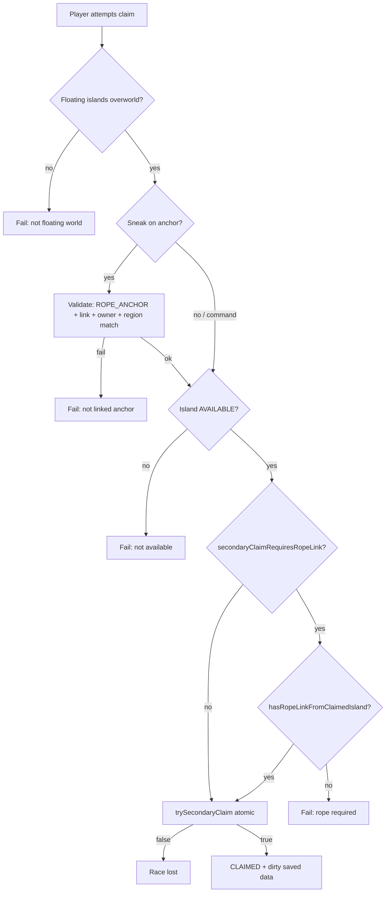

# Phase 4 — Dock / link specification (secondary claims)

> **Superseded (gameplay):** rope links are **public ziplines** — no topology enforcement, no `/projectisland island claim`, no auto-claim on harpoon. Starter homes use **`StarterHomes`** only (no **`IslandState#CLAIMED`** for new assignments). The sections below describe the **retired** dock/claim model and remain as historical reference.

This document was the **authoritative design** for how a non-starter island became **CLAIMED**, how **rope links** were enforced against topology, and what was **deferred** (e.g. airship movement, dedicated dock blocks). It matched an older **1.21.1 NeoForge** codebase; current behavior defers to source + README.

---

## 1. Goals

- **No free teleport-to-claim** for extra islands: the player must establish a **server-validated rope network** (or satisfy the relaxed command path) before an **AVAILABLE** region can flip to **CLAIMED**.
- **Starter island** stays a separate flow (`FloatingIslandStarterPlacement` + `StarterHomes`); this spec covers **secondary** claims only.
- **Trust the server**: clients cannot force a claim; all checks run on the **server thread** against `FloatingIslandSavedData`.

---

## 2. Terms

| Term | Meaning |
|------|--------|
| **Island region** | `FloatingIslandKey` — coarse `(regionX, regionZ)` grid aligned with `FloatingIslandLayout.REGION_CHUNKS` (default **8×8 chunks** per cell). |
| **Physical link** | A persisted **`RopeLink`**: two **rope anchor** block positions, two region keys, owner UUID, max length, health. Created only by **`HarpoonGunItem`** after both anchors pass validation. |
| **Logical claim gate** | `FloatingIslandSavedData#hasRopeLinkFromClaimedIsland` — “does this player already have a rope from the **target** region to a region they **already claim** (or their **starter**)?” |
| **Dock (informal)** | In v1 there is **no separate dock block**. The “dock” is: **your harpoon anchor** on the target island (sneak-use claim) **or** any valid anchor surface used when the rope was shot. |

---

## 3. Rope creation (harpoon) — physical rules

Implemented in **`HarpoonGunItem`**; second shot must pass **all** of the following.

**Tiered caps (progression):** the server derives a rope tier from advancements (`RopeProgression`) and scales the base
caps for **new** links:

- **BASIC**: 1.00× max length, 1.00× max health
- **REINFORCED** (`projectisland:progression/rope_reinforced`): 1.25× length, 1.50× health
- **STEEL** (`projectisland:progression/rope_steel`): 1.50× length, 2.25× health

Existing links are upgraded server-side when `ropeProgressionUpgradeExistingLinks` is enabled (see `RopeLinkProgressionUpgrade`),
preserving health fraction.

1. **Dimension** — `ProjectIslandDimensions.isFloatingIslandsGameplay(level)` (floating-islands overworld only).
2. **Raycast** — From player eye along look vector, `ClipContext` **OUTLINE** blocks, fluid ignored, range **`ropeLinkRaycastRangeBlocks`** (common config).
3. **Hit block** — Must be **BLOCK** hit; block must not be a **falling** block (`FallingBlock`); must not be **air**; destroy speed ≥ **0** on empty getter (excludes most replaceables / weird cases).
4. **Surface ownership** — Hit position `(x,z)` must resolve to an island region via **`FloatingIslandLayout.islandOwningSurface`** (same rule as “is this column part of an island mass?”). If empty → “not island surface” feedback.
5. **Two distinct regions** — First and second endpoints must be **different** `FloatingIslandKey` values.
6. **Span** — Euclidean distance between anchor block centers ≤ **`ropeLinkMaxLengthBlocks`**. Stored on the `RopeLink` as `maxLengthBlocks` for strain / future rules.
7. **Topology** — If **`ropeTopologyEnabled`**: `RopeTopology.validateNewRopeLink` builds an adjacency graph of this owner’s links **plus** the proposed edge and checks:
   - **Connectivity** to the player’s **starter** region (`StarterHomes`).
   - **Max depth** from starter ≤ effective cap (`ropeTopologyMaxDepthFromStarter`, clamped to **1** when `ropeAllowTertiaryIslandLinks` is **false**).
   - **Main hub spokes** — number of distinct neighbors of the starter ≤ `ropeMainDirectSpokeCap`.
   - **Sister outbound** — for each **claimed** non-starter region in the BFS tree, count of rope neighbors that are **not** the starter; each must be ≤ `ropeSisterOutboundCap`.
8. **Placement** — Anchor replaces the targeted block (`RopeAnchorBlock` + `RopeAnchorBlockEntity` stores **original** block for restore on break). Placement uses normal `setBlock` semantics (fails if protected, etc.).

**Not validated on harpoon today:** explicit **facing** toward the other island, **line-of-sight** between anchors after placement, or a **whitelist of block tags** for “dock material” — any solid non-falling block on the owned surface column qualifies.

---

## 4. Logical claim gate (`secondaryClaimRequiresRopeLink`)

When **`secondaryClaimRequiresRopeLink`** is **true** (default), **`IslandSecondaryClaim`** requires **`hasRopeLinkFromClaimedIsland(claimer, targetKey)`** before `trySecondaryClaim` succeeds.

Semantics (**`FloatingIslandSavedData`**):

- Iterate **owned** `RopeLink`s where one endpoint key equals **`targetKey`**.
- Let **`other`** be the opposite endpoint’s region key.
- Gate passes if **`other`** is **CLAIMED by the same player**, **or** **`other`** equals that player’s **starter** region (even if the island row is inconsistent — data edge-case guard).

So the **minimum** story is: *you must have already shot a rope from this AVAILABLE region to something you already own (or your starter).* Auto-claim on rope completion uses the same saved-data path when **`autoClaimIslandOnRopeLink`** is true (`tryAutoClaimIslandAfterRopePlaced`).

---

## 5. Claim surfaces (how the player triggers CLAIMED)

| Path | Permission / interaction | Anchor validation | Region used |
|------|-------------------------|-------------------|-------------|
| **`/projectisland island claim`** | Brigadier **`secondaryClaimCommandPermissionLevel`** (default **0**) | **None** — only feet column `IslandWorld.keyAt(feet)` | Island under **feet** |
| **Sneak + use** (empty hand) on **`rope_anchor`** | None (no OP gate) | Block must be **`ROPE_ANCHOR`**, have a **link**, link owner = player, anchor’s region = target island | Island of **that anchor** |

Both paths call **`IslandSecondaryClaim.tryAtIsland`** (command passes `ropeAnchorPos = null`; block passes the anchor position). Shared checks: floating overworld, row **AVAILABLE**, rope gate if config on, then **atomic** `trySecondaryClaim`.

---

## 6. Rope removal and claim integrity

When a link is removed (`removeRopeLink`) and **`secondaryClaimRequiresRopeLink`** is **true**, **`revalidateRopeBackedClaimsForOwner`** runs: every **non-starter** island **CLAIMED** by that player must still satisfy **`hasRopeLinkFromClaimedIsland`** to some other **claimed** or **starter** region; otherwise the row reverts to **AVAILABLE**.

Breaking **both** anchors removes the link and can revert secondary claims that depended on it.

---

## 7. Anti-exploit and known gaps (v1)

**What the server already constrains**

- Ropes only on **island-owning** columns; **span** and **topology** caps; **owner** on link; **atomic** claim transition (race → `RACE_LOST`).
- Sneak-use claim **must** interact with **your** linked anchor on the **correct** region.

**Known gaps (acceptable for MVP unless you tighten in code)**

1. **`/projectisland island claim`** does **not** require the player to be **near** the target island or either anchor — only a valid rope in saved data + feet on the target column. A player could theoretically stand on the target coast with a valid link created earlier from elsewhere.
2. **No facing / LOS** at claim or at rope placement (beyond initial raycast per shot).
3. **No “moving assembly”** check — islands are fixed in world space until Phase 6 propulsion exists.
4. **Rope stress** can sever a link at 0 health (`RopeLinkStress` / sever path); that triggers the same **revalidate** behavior as manual break — design intent: **physical link failure can lose the claim**.

**Recommended hardening (future issues / PRs)**

- **`secondaryClaimCommandMaxDistanceBlocks`** (common config): for **command** claims only, require the player to be within a horizontal distance of a **real** rope anchor endpoint on the target island that participates in a valid owned link (same logic as `hasRopeLinkFromClaimedIsland`). This prevents “remote” claims from across the map.
- Optional **tag-based** allowed anchor blocks (`#projectisland:rope_anchor_support` or vanilla tags).
- **Contested** / PvP capture (Phase 5) may supersede parts of this doc.

---

## 8. Config quick reference

| Key | Role |
|-----|------|
| `ropeLinkRaycastRangeBlocks` | Harpoon aim range per shot. |
| `ropeLinkMaxLengthBlocks` | Max Euclidean span; also stored on `RopeLink`. |
| `ropeTopologyEnabled` | Master switch for graph checks. |
| `ropeTopologyMaxDepthFromStarter` | BFS depth cap when tertiary allowed. |
| `ropeAllowTertiaryIslandLinks` | If false, depth cap effectively **1** (starter + one ring). |
| `ropeMainDirectSpokeCap` | Max distinct islands directly roped to starter. |
| `ropeSisterOutboundCap` | Max “outbound” rope neighbors per claimed non-starter. |
| `secondaryClaimRequiresRopeLink` | Logical gate for command + anchor claim. |
| `secondaryClaimCommandPermissionLevel` | OP level for `/projectisland island claim`. |
| `secondaryClaimCommandMaxDistanceBlocks` | For command claims: max horizontal distance to a valid rope endpoint on the target island (0 disables). |
| `autoClaimIslandOnRopeLink` | Auto `trySecondaryClaim` when completing a rope from hub to AVAILABLE. |
| `ropeProgressionUpgradeExistingLinks` | When true, existing links are upgraded to match the owner’s tier. |
| `ropeProgressionUpgradeIntervalTicks` | How often to scan and upgrade existing links (ticks). |

---

## 9. Server validation sequence (secondary claim)

Rope **creation** sequence is: first shot → pending NBT → second shot → span → topology → place second anchor → `putRopeLink` → optional `tryAutoClaimIslandAfterRopePlaced`.

---

## 10. Related source files

- `IslandSecondaryClaim.java` — claim outcomes and anchor validation.
- `FloatingIslandSavedData.java` — `hasRopeLinkFromClaimedIsland`, `trySecondaryClaim`, `tryAutoClaimIslandAfterRopePlaced`, `revalidateRopeBackedClaimsForOwner`.
- `HarpoonGunItem.java` — raycast, placement, span, topology hook.
- `RopeTopology.java` — graph caps.
- `RopeAnchorBlock.java` — sneak + use → claim.
- `IslandCommands.java` — `/projectisland island claim`.

---

## 11. Revision history

| Date | Change |
|------|--------|
| 2026-04-25 | Initial spec from codebase audit; marks MVP vs deferred hardening. |
